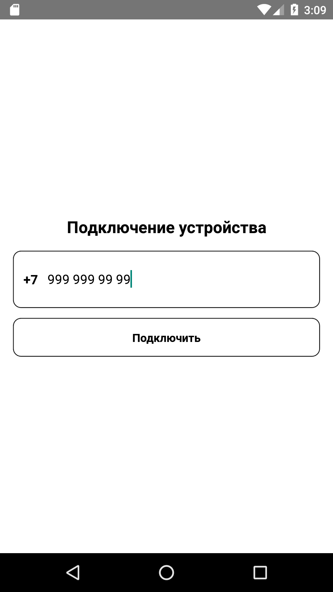
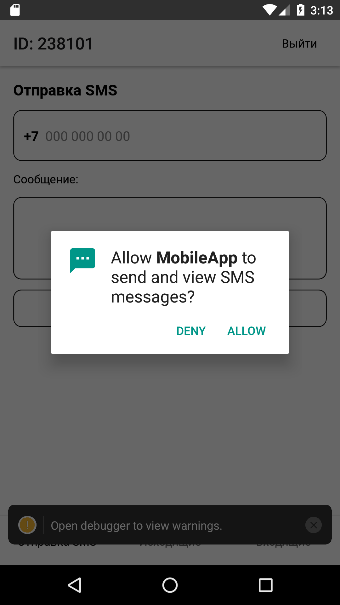
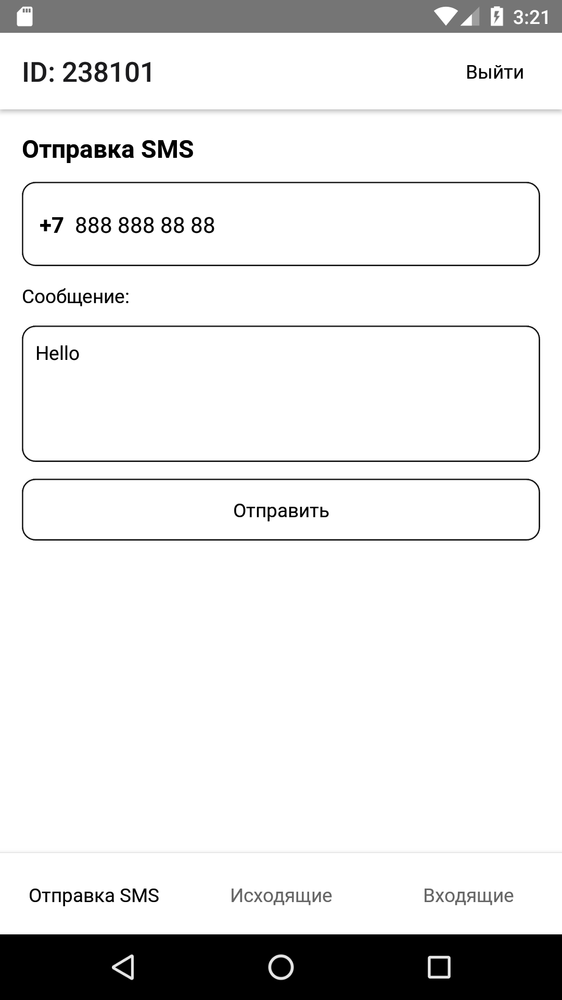
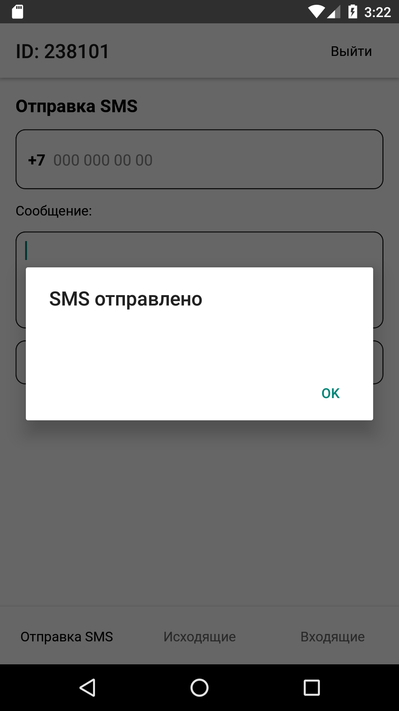
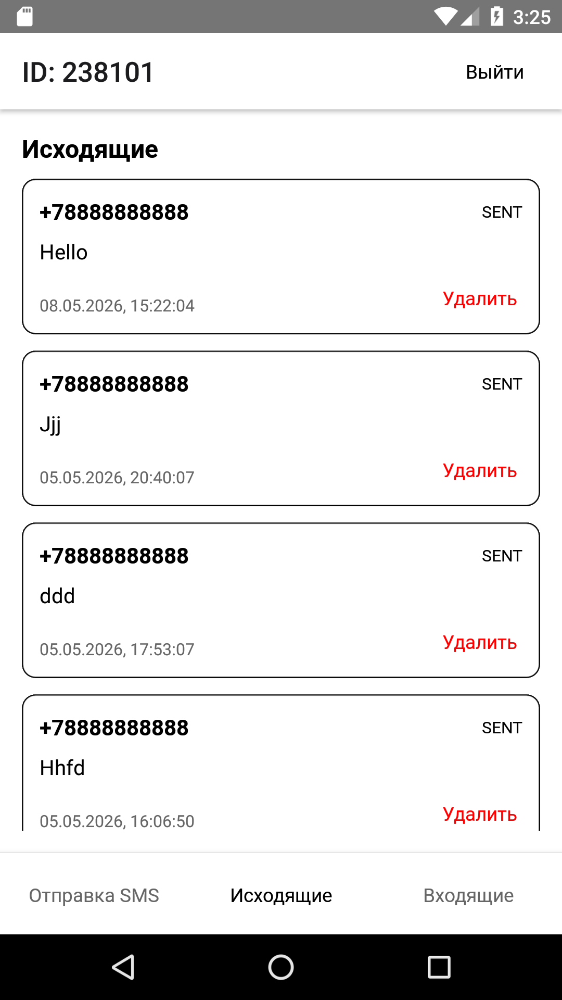
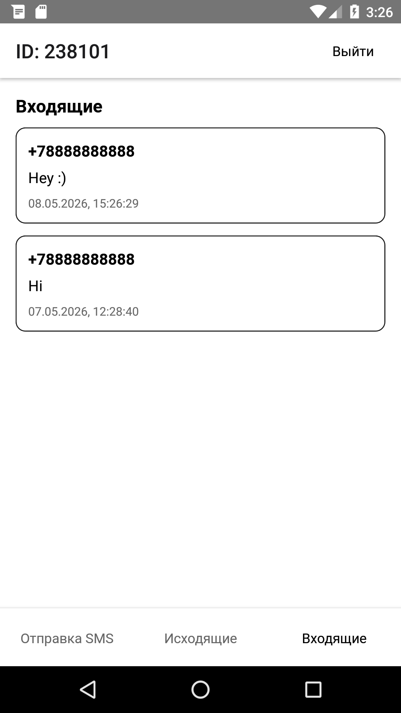
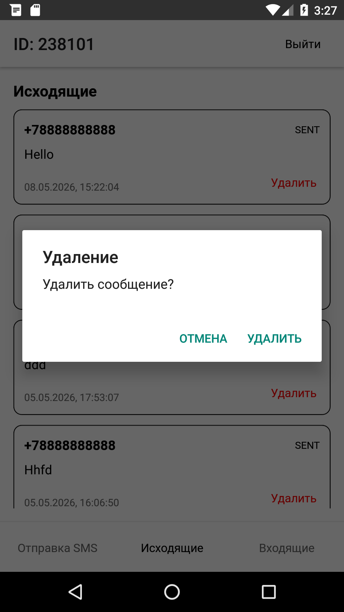

# Мобильное приложение

## Подключение устройства

1. Открыть приложение
2. Ввести номер телефона
3. Нажать «Подключить»

    

4. Разрешить отправку и просмотр SMS

   

---

## Отправка SMS

1. Ввести номер получателя
2. Написать текст сообщения
3. Нажать «Отправить»

 

---

## Просмотр сообщений

Вкладки:
- Исходящие - SMS, которые вы отправили со статусами

  

- Входящие - SMS, пришедшие от других зарегистрированных устройств

  

---

## Удаление сообщений

Во вкладке «Исходящие» → кнопка «Удалить» рядом с сообщением.

