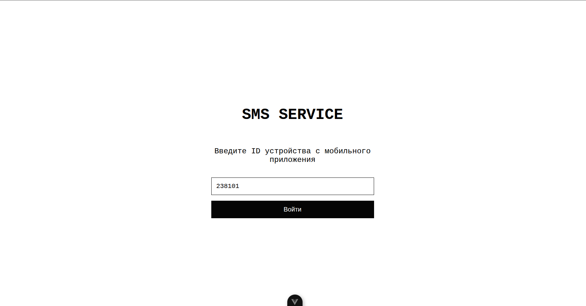
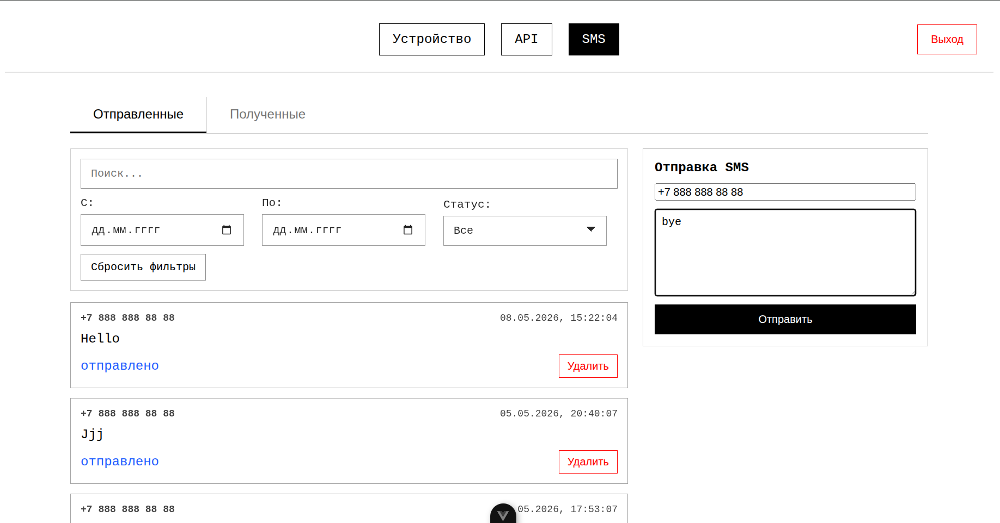
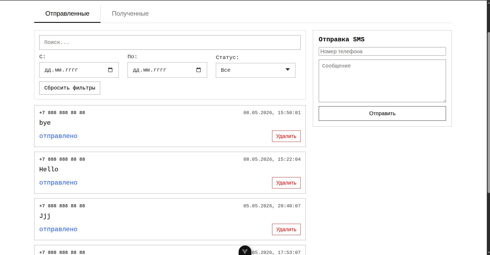
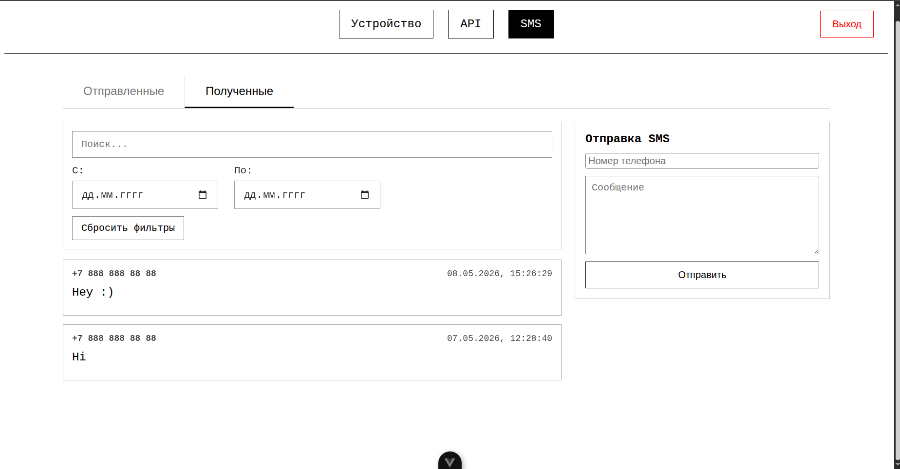
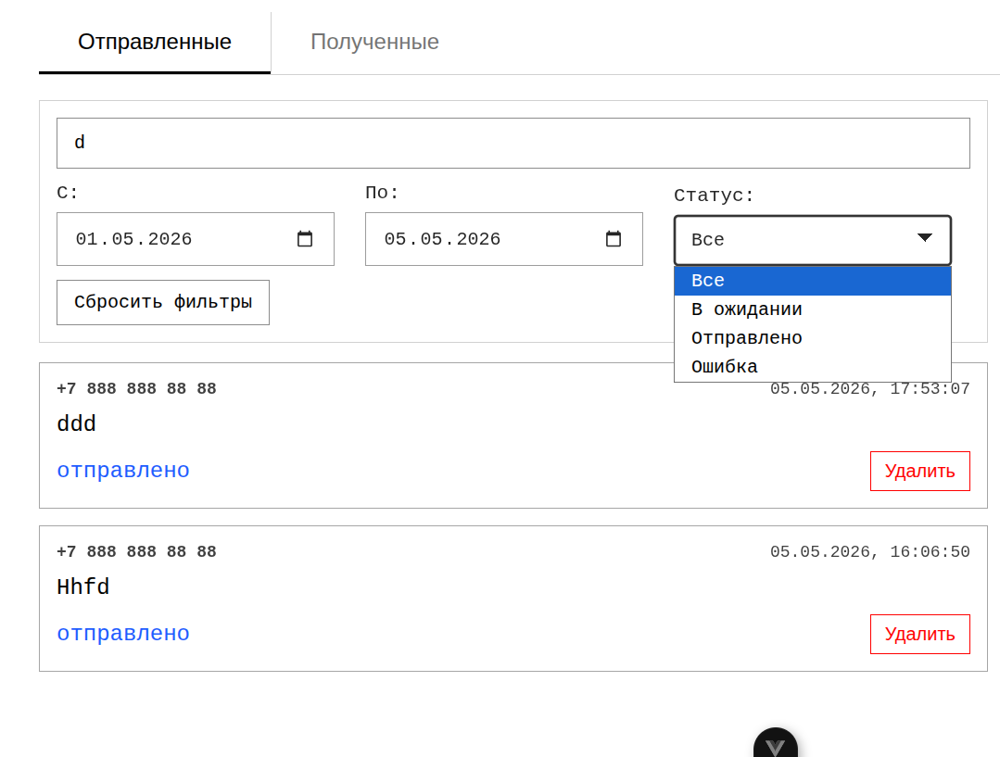
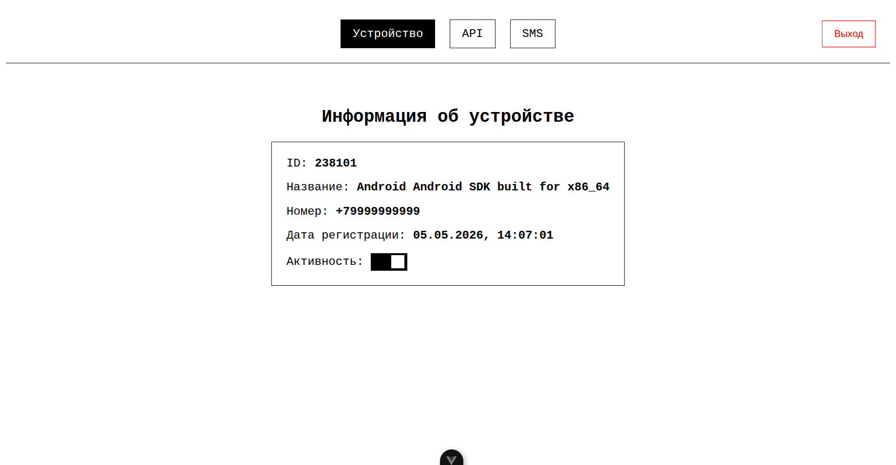
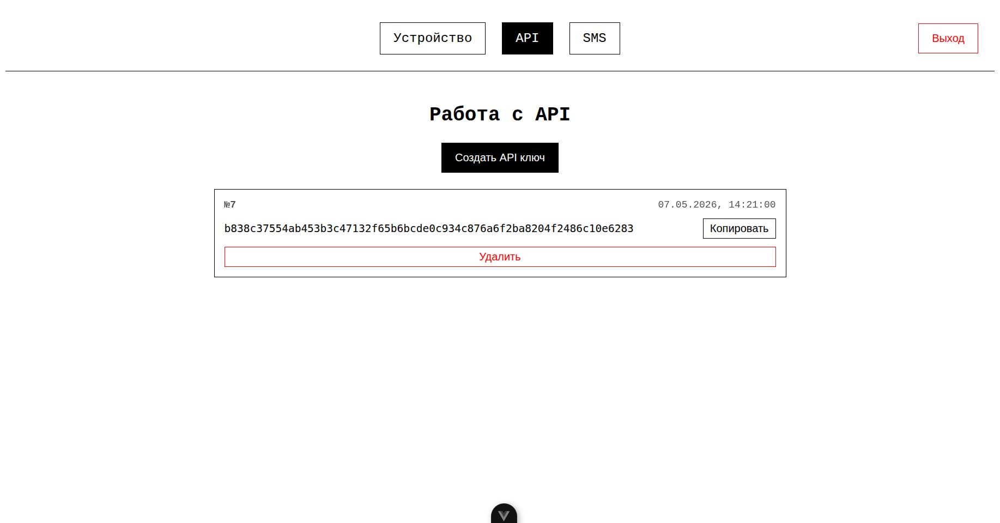

# Веб-приложение

## Вход

1. Ввести ID устройства (полученный при регистрации в мобильном приложении)
2. Нажать «Войти»

---

## Отправка SMS - раздел «SMS»

1. В форме справа заполнить:
   - номер телефона
   - сообщение
2. Нажать «Отправить»

---

## Просмотр сообщений

### Вкладка «Отправленные»

### Вкладка «Полученные»

---

## Удаление сообщений

Во вкладке «Отправленные» → кнопка «Удалить» рядом с сообщением.

---

## Фильтрация и поиск

В разделе «SMS» доступен поиск и фильтрация сообщений:
- поиск: по всем значениям
- фильтрация: по дате и статусу

---

## Устройство

В разделе «Устройство» можно посмотреть данные о подключенном устройстве, а также установить его активность.

## API

### Получение API ключа

В разделе «API» нажать «Создать API ключ».

### Удаление API ключа

Нажать «Удалить» на карточке API ключа.
